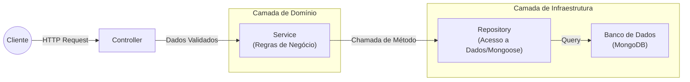
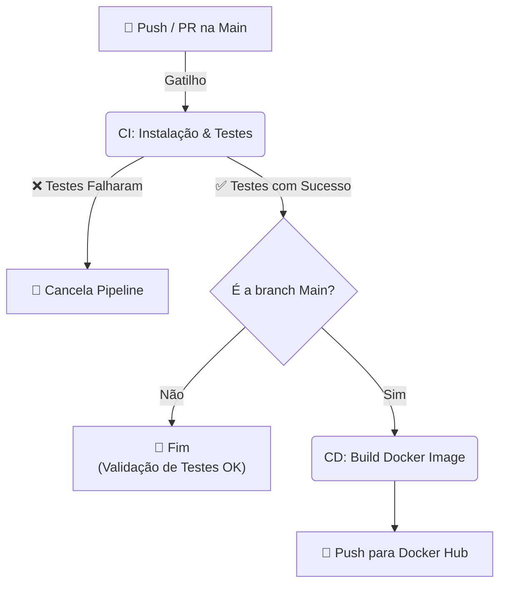

# 📚 Atividade do Curso de Full Stack Development da FIAP: Plataforma de Blogging para Educação Pública


**_Este projeto faz parte do Tech Challenge do curso de Full Stack Development da FIAP (Turma 7FSDT), tendo objetivo puramente educacional e vinculado à conclusão das atividades do curso._**

A atividade propõe o desenvolvimento de uma plataforma de blogging voltada à educação pública, com o objetivo fictício de possibilitar a criação e o compartilhamento de conteúdos educacionais por professores da rede pública, facilitando o acesso dos alunos a materiais de estudo.

---

## FIAP -  Tech Challenge 02:

### 📌 Cenário e Problema Proposto
A primeira versão da solução foi desenvolvida utilizando **OutSystems**, com boa aceitação em nível comunitário.  
Nesta nova etapa, o projeto evolui para um cenário de maior escala, exigindo a reescrita do backend (uma API de Posts) em Node.js e a escolha de um banco apropriado.

### 🛠️ Requisitos Técnicos

- ✅ **Back-end em Node.js e framework para roteamento e middleware**
    - Utilizamos TypeScript, Node.js e Express
- ✅ **Persistência de dados em banco com modelos adequados**
    - Escolhemos o MongoDB e usamos o Mongoose para definir schemas
- ✅ **Containerização com Docker para consistência de ambientes**
    - A consistência é atingida usando Dockerfile multi-stage, build para o Docker Hub e Docker compose para subir aplicação e banco de dados.
- ✅ **Pipeline de CI/CD com GitHub Actions**
    - Todo push ou PR para a main roda testes e, caso passem, o fluxo de deploy gera uma imagem atualizada no Docker Hub.
- ⏳ **20% de cobertura de testes unitários**
    - Estamos cobrindo XXXX% pois ...
- ⏳ **Documentação técnica detalhada do projeto (setup, arquitetura e uso da API)**
    - Toda contida neste README.md do projeto.

### 📦 Entregáveis 
- ✅ Código-fonte: repositório GitHub com o código do projeto,
incluindo Dockerfiles e scripts de CI/CD.
- ⏳ Apresentação Gravada: demonstração em vídeo do
funcionamento da aplicação, incluindo detalhes técnicos de
implementação.
- ⏳ Documentação: descrevendo a arquitetura do
sistema, uso da aplicação, relato de experiências e desafios
enfrentados pela equipe durante o desenvolvimento (pode estar no README).

### 👥 Grupo
Grupo 20:
- Ana Caroline Gonzaga Acquesta
- Bruno de Camargo Guimarães
- Luiz Alfredo Bernardo
- Roberta Alves de Oliveira

---

## ⚙️ Funcionalidades

### API – Endpoints

- `GET /posts` – Lista de postagens disponíveis para leitura
- `GET /posts/:id` – Retorna o conteúdo completo de uma postagem
- `POST /posts` – Criação de uma nova postagem
- `PUT /posts/:id` – Atualização de uma postagem
- `DELETE /posts/:id` – Remoção de uma postagem
- `GET /posts/search` – Busca por palavras-chave

---

## 🏗️ Arquitetura

O projeto segue uma arquitetura em camadas (Layered Architecture), visando desacoplamento e testabilidade e facilidade de manutenção. Cada camada tem uma responsabilidade bem definida.

### Fluxo de Dados




### Estrutura de Pastas

A estrutura de pastas reflete a arquitetura definida:

```
src
│   app.ts              # Configuração do App (Express)
│   server.ts           # Inicialização do servidor e conexão com DB
└───api
    └───controllers     # Camada de controle (Interface HTTP)
    └───services        # Regras de negócio e validações
    └───repositories    # Implementação da persistência com Mongoose
    └───models          # Schemas do MongoDB
└───routes              # Definição das rotas da API
└───utils               # Utilitários (classes de erro, etc.)
└───config              # Configurações de ambiente e banco de dados
```

- **Routes:** Mapeia os endpoints da API para os controllers.
- **Controllers:** Recebem as requisições HTTP. Sua responsabilidade é extrair dados do request e chamar a camada de serviço para retornar a resposta. Não devem conter regras de negócio.
- **Services:** Contêm a lógica de negócio e as validações. Por exemplo, o PostService valida se um post tem título válido antes de criar. É aqui que os erros de negócio (AppError) são lançados.
- **Repositories:** Camada de abstração do acesso a dados. Utiliza o PostModel do Mongoose para interagir com o MongoDB.
- **Models:** Define os schemas e interfaces do Mongoose.
- **Utils:** Ferramentas auxiliares, como a classe AppError para padronização de erros.

---

## 🚀 Instalação e Execução

### Pré-requisitos

- [Node.js](https://nodejs.org/) (versão 24.x)
- [Docker](https://www.docker.com/)
- (Recomendado) A extensão [REST Client](https://marketplace.visualstudio.com/items?itemName=humao.rest-client) para VS Code, para testar a API.

### Opção 1: Execução Híbrida (local+Docker), recomendada para desenvolvimento
Neste modo, o banco roda no Docker, mas a API roda localmente no seu Node.js, permitindo Hot Reload.

1.  **Clone o repositório:**
    ```bash
    git clone https://github.com/FIAPGrupo20/DiarioDeClasse.git
    cd DiarioDeClasse
    ```
2.  **Suba o banco de dados:**
    ```bash
    docker compose up -d mongo
    ```
3.  **Instale as dependências:**
    ```bash
    npm install
    ```

4.  **Configure as variáveis de ambiente:**
    Se estiver usando Docker local, o valor padrão já funciona. Se for usar o MongoDB Atlas, ao invés do Docker, edite a variável `DB_CONNECTION_STRING` no novo arquivo `.env`.

4.  **Inicie a aplicação da API:**
    ```bash
    npm run dev
    ```
    _O servidor estará disponível em `http://localhost:3000`._

### Opção 2: Full Docker, recomendada para simular produção
Roda tanto a aplicação quanto o banco dentro de containers, isolando o ambiente completamente. O Docker Compose já configura a rede entre a API e o MongoDB:

```bash
# Constrói a imagem e sobe os containers
docker compose up --build
```
 _O servidor estará disponível em `http://localhost:3000`._

---

## 🧪 Testes
O projeto possui duas formas de teste: testes automatizados e testes manuais da API.

### Testes Automatizados (Jest):
Para rodar a suite de testes unitários:
```bash
npm run test
```
### Testes Manuais (REST Client):
Para facilitar a interação e os testes com os endpoints da API, o projeto inclui o arquivo requests.http. Recomendamos o uso da extensão REST Client para Visual Studio Code.
1. Instale a extensão REST Client no seu VS Code.
2. Com a aplicação em execução, abra o arquivo requests.http.
3. Clique no texto Send Request que aparece acima de cada requisição que deseja testar.
4. A resposta da API será exibida em uma nova aba ao lado.

### Boas Práticas para Testes

Para manter a qualidade e a consistência dos testes automatizados, siga as seguintes boas práticas ao criar novos testes:

1.  **Estrutura de Diretórios:**
    Mantenha a estrutura de diretórios de `src` espelhada na pasta `tests`. Isso facilita a localização dos testes correspondentes a cada arquivo da aplicação.
    - Exemplo: O teste para `src/api/services/PostService.ts` deve estar em `tests/api/services/PostService.test.ts`.

2.  **Nomenclatura:**
    - **Arquivos:** Nomeie os arquivos de teste com o sufixo `.test.ts` (ex: `NomeDoArquivo.test.ts`).
    - **Descrições:** Escreva descrições claras e objetivas nos blocos `describe` (contexto) e `it` (comportamento esperado). Utilize o padrão "deve [fazer algo] quando [em tal condição]".

3.  **Padrão AAA (Arrange, Act, Assert):**
    Organize seus testes em três partes distintas para maior clareza:
    - **Arrange:** Configure as condições iniciais, como mocks, dados de entrada e instâncias de classes.
    - **Act:** Execute a função ou o método que está sendo testado.
    - **Assert:** Verifique se o resultado obtido é o esperado.

4.  **Independência dos Testes:**
    Cada bloco `it` deve ser independente. A execução de um teste não deve afetar o resultado de outro. Utilize `beforeEach` para resetar o estado entre os testes.

---

## 🔄 CI/CD e DevOps

Este projeto utiliza **GitHub Actions** para automação da esteira de desenvolvimento, garantindo a qualidade do código e a entrega contínua da aplicação.

### Pipeline Automatizado

O fluxo de trabalho (`.github/workflows/main.yml`) é acionado em todo *push* ou *Pull Request* para a branch `main`. A partir daí:

1. CI: Instala dependências (existe um cache de dependências), sobe um serviço MongoDB temporário e executa os testes.

2. CD: Se os testes passarem (e for branch main), constrói a imagem Docker a partir do Dockerfle multi-stage e faz o push para o Docker Hub com versionamento semântico.



---

## 📜 Licença

Este projeto está licenciado sob a **Licença MIT**.
A licença permite o uso, modificação e distribuição do software, desde que os créditos e os termos da licença original sejam preservados.