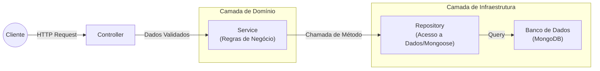
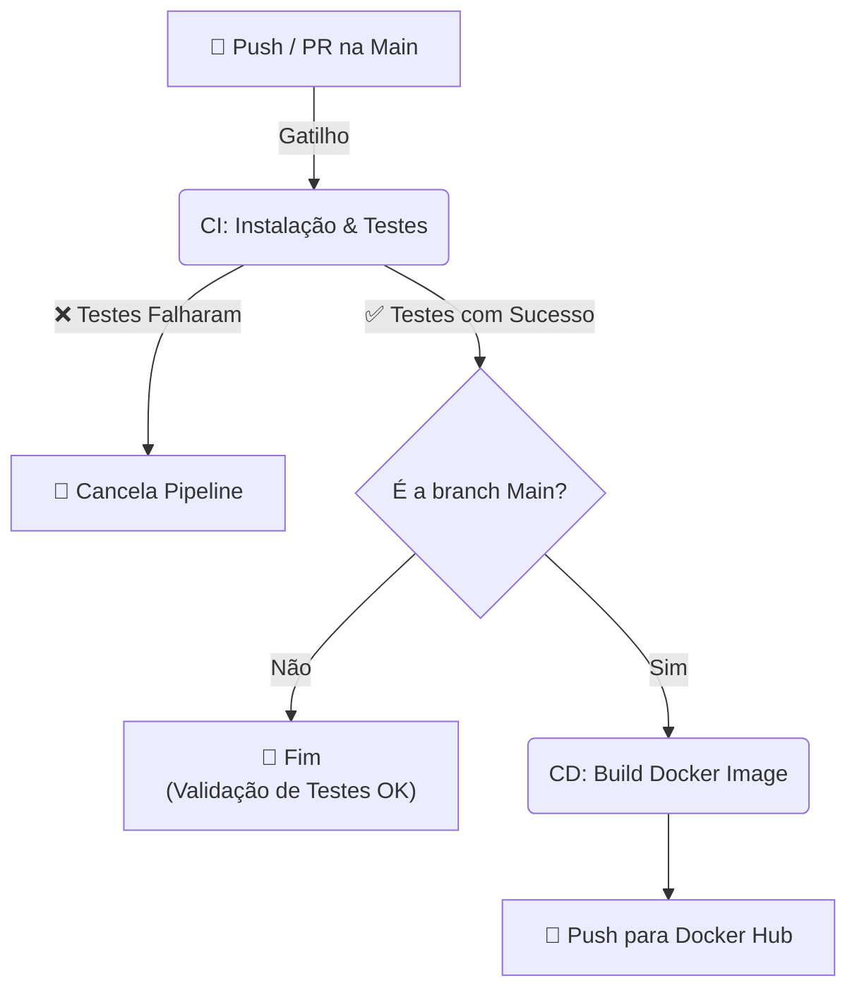

# 📚 Atividade do Curso de Full Stack Development da FIAP: Plataforma de Blogging para Educação Pública


## Contexto deste Repositório:

**_Este projeto faz parte do Tech Challenge do curso de Full Stack Development da FIAP (Turma 7FSDT), tendo objetivo puramente educacional e vinculado à conclusão das atividades do curso._**

---

## Documentação FIAP -  Tech Challenge 02:

### 📌 Cenário e Problema Proposto
A primeira versão da solução foi desenvolvida utilizando **OutSystems**, com boa aceitação em nível comunitário.  
Nesta nova etapa, o projeto evoluiu para um cenário de maior escala, exigindo a reescrita do backend (uma API de Posts) em Node.js e a escolha de um banco apropriado.

### 🛠️ Requisitos Técnicos e Resumo de Como Foram Alcançados

- ✅ **Back-end em Node.js e framework para roteamento e middleware**
    - Utilizamos TypeScript, Node.js e Express
- ✅ **Persistência de dados em banco com modelos adequados**
    - Escolhemos o MongoDB e usamos o Mongoose para definir schemas
- ✅ **Containerização com Docker para consistência de ambientes**
    - A consistência é atingida usando Dockerfile multi-stage, build da imagem para o Docker Hub e Docker compose para subir aplicação e banco de dados.
- ✅ **Pipeline de CI/CD com GitHub Actions**
    - Todo push ou PR para a main roda testes e, caso passem, o fluxo de deploy gera uma imagem atualizada no Docker Hub.
- ✅ **>20% de cobertura de testes unitários**
    - Pelo report de coverage do Jest, estamos cobrindo cerca de **66%** dos statements da aplicação inteira e **89%** das funções como um todo. Porém a lógica principal (controller, service, repository) está **99%** coberta.
- ✅ **Documentação técnica detalhada do projeto (setup, arquitetura e uso da API)**
    - Toda contida neste README.md do projeto e pode-se acessar o Swagger para ter mais detalhe da estrutura do do request e resposta da API para cada caso.

### 📦 Lista de Entregáveis 
- ✅ Código-fonte: repositório GitHub com o código do projeto,
incluindo Dockerfiles e scripts de CI/CD.
    - Tudo neste repositório.
- ✅ Apresentação Gravada: demonstração em vídeo do
funcionamento da aplicação, incluindo detalhes técnicos de
implementação.
    - Enviada na plataforma da FIAP.
- ✅ Documentação: descrevendo a arquitetura do
sistema, uso da aplicação, relato de experiências e desafios
enfrentados pela equipe durante o desenvolvimento (pode estar no README).
    - Tudo neste Readme e Swagger.

### 📝 Relato de Experiências e Desafios

O desenvolvimento desta fase representou um salto de complexidade técnica em relação à anterior, exigindo do nosso grupo um bom planejamento para conciliar as aulas com a própria entrega.

#### 📅 Fim de Ano e Gestão de Tempo
Essa fase coincidiu com o final do ano, somando o impacto das festividades, desafios pessoais de todos e recessos à carga horária de aulas, que nos pareceu superior à da fase anterior. Esse cenário exigiu que a gente usasse uma boa estratégia para "tentar fazer o máximo com o que temos" e que evitássemos grandes dependências entre nós.

#### 🏗️ Estratégia Incremental: "Simples Primeiro"
Para gerenciar a complexidade e permitir que todos os membros contribuíssem independentemente do progresso nas aulas teóricas de banco de dados, adotamos uma abordagem incremental:

1.  **MVP em Memória:** Iniciamos com uma API funcional utilizando persistência em memória (Array), validada exclusivamente por testes manuais (`requests.http` e REST Client).
2.  **Refatoração Arquitetural:** Organizamos o código em Camadas (Controllers, Services, Repositories). O objetivo foi isolar a lógica de negócio da infraestrutura desde cedo, já que sabíamos que o banco de dados viria depois e não queríamos integrá-lo naquele momento.
3.  **Containerização:** Garantimos que a aplicação rodasse isolada via Docker.
4.  **Criação da Infra de Testes Automatizados:** Implementamos a estrutura da suíte de testes unitários (Jest). Esta etapa foi crucial ser feita antes do CI/CD, para garantir que o pipeline tivesse o que validar.
5.  **DevOps (CI/CD):** Configuramos a esteira no GitHub Actions para automatizar a execução dos testes criados na etapa anterior e o push da imagem no Docker Hub.
6.  **Aumento da Cobertura de Testes Automatizados:** Nesse momento conseguimos paralelizar melhor as atividades do grupo e focamos em aumentar a cobertura de testes e na persistência do banco.
7.  **Persistência Real (MongoDB):** Apenas na etapa final substituímos o repositório em memória pelo MongoDB. Como a arquitetura já estava desacoplada e testada, essa migração foi segura e de baixo impacto.
8.  **Polimento:** Finalizamos removendo parâmetros internos do banco dos retornos da API e implementando a documentação via Swagger.

Essa ordem cronológica permitiu lidar com a complexidade do banco de dados apenas no final, mantendo o time produtivo nas regras de negócio e testes enquanto o conhecimento sobre NoSQL era consolidado (nem todos os membros consumiram as aulas em ordem sequencial).

#### 🤖 O Papel da Inteligência Artificial
Utilizamos IA Generativa como um "copiloto" técnico. Ela foi fundamental para:
* Acelerar a escrita de testes unitários e documentação técnica (boilerplate).
* Apoiar no entendimento de trechos de código produzidos por outros colegas e como "mais um par de olhos" em refactorings.
* Sugerir correções rápidas de bugs.

Embora o uso da IA tenha exigido supervisão linha a linha para garantir a integridade da lógica, ela eliminou grande parte do trabalho repetitivo, permitindo que o time focasse na arquitetura e nas regras de negócio.

#### 💡 Lições Aprendidas
* Em retrospecto, identificamos que a implementação dos testes unitários poderia ter ocorrido ainda mais cedo. Se tivéssemos iniciado com os testes (abordagem TDD), teríamos reduzido o ciclo de feedback inicial. No entanto, a cobertura atual garante a segurança necessária para as futuras evoluções da plataforma.
* Foi muito importante manter a documentação mínima de desenvolvimento durante o projeto (como rodar, como testar, como o CI/CD funciona, etc.) pois permitiu que todos os membro do grupo fosse experimentando as novidades conforme iam surgindo.

### 👥 Composição do Grupo
Grupo 23:
- Ana Caroline Gonzaga Acquesta
- Bruno de Camargo Guimarães
- Luiz Alfredo Bernardo
- Roberta Alves de Oliveira

---

## README (Documentação Técnica):

Este repositório contém o código da API usada no backend da aplicação `Diario de Classe`, uma plataforma de blogging voltada à educação pública, com o objetivo [fictício](#contexto-deste-repositório) de possibilitar a criação e o compartilhamento de conteúdos educacionais por professores da rede pública, facilitando o acesso dos alunos a materiais de estudo.

### ⚙️ Funcionalidades

#### API – Endpoints

- `GET /posts` – Lista de postagens disponíveis para leitura
- `GET /posts/:id` – Retorna o conteúdo completo de uma postagem
- `POST /posts` – Criação de uma nova postagem
- `PUT /posts/:id` – Atualização de uma postagem
- `DELETE /posts/:id` – Remoção de uma postagem
- `GET /posts/search` – Busca por palavras-chave

_A documentação **live** da api pode ser vista via [Swagger](#testes-manuais-swagger) ao acessar http://localhost:3000/api-docs/ quando rodando local_

### 🏗️ Arquitetura

O projeto segue uma arquitetura em camadas (Layered Architecture), visando desacoplamento e testabilidade e facilidade de manutenção. Cada camada tem uma responsabilidade bem definida.

#### Fluxo de Dados




#### Estrutura de Pastas

A estrutura de pastas reflete a arquitetura definida:

```
src
│   app.ts              # Configuração do App (Express)
│   server.ts           # Inicialização do servidor e conexão com DB
└───api
    └───controllers     # Camada de controle (Interface HTTP)
    └───services        # Regras de negócio e validações
    └───repositories    # Implementação da persistência com Mongoose
    └───models          # Schemas do MongoDB
└───routes              # Definição das rotas da API
└───utils               # Utilitários (classes de erro, etc.)
└───config              # Configurações de ambiente e banco de dados
```

- **Routes:** Mapeia os endpoints da API para os controllers.
- **Controllers:** Recebem as requisições HTTP. Sua responsabilidade é extrair dados do request e chamar a camada de serviço para retornar a resposta. Não devem conter regras de negócio.
- **Services:** Contêm a lógica de negócio e as validações. Por exemplo, o PostService valida se um post tem título válido antes de criar. É aqui que os erros de negócio (AppError) são lançados.
- **Repositories:** Camada de abstração do acesso a dados. Utiliza o PostModel do Mongoose para interagir com o MongoDB.
- **Models:** Define os schemas e interfaces do Mongoose.
- **Utils:** Ferramentas auxiliares, como a classe AppError para padronização de erros.
- **Config:** Configurações como as de ambiente, banco de dados e swagger.


### 🚀 Instalação e Execução

#### Pré-requisitos

- [Node.js](https://nodejs.org/) (versão 24.x)
- [Docker](https://www.docker.com/)
- (Recomendado) A extensão [REST Client](https://marketplace.visualstudio.com/items?itemName=humao.rest-client) para VS Code, para testar a API.

#### Opção 1: Execução Híbrida (local+Docker), recomendada para desenvolvimento
Neste modo, o banco roda no Docker, mas a API roda localmente no seu Node.js, permitindo Hot Reload.

1.  **Clone o repositório:**
    ```bash
    git clone https://github.com/FIAPGrupo20/DiarioDeClasse.git
    cd DiarioDeClasse
    ```
2.  **Suba o banco de dados:**
    ```bash
    docker compose up -d mongo
    ```
3.  **Instale as dependências:**
    ```bash
    npm install
    ```

4.  **Configure as variáveis de ambiente:**
    Crie um arquivo `.env` na raiz do projeto com base no exemplo abaixo:
    ```env
    MONGO_USER=admin
    MONGO_PASSWORD=senha_local
    MONGO_DB=diario_de_classe
    ```
    _Obs: Existe um arquivo `.env.example` que pode ser usado como base._

4.  **Inicie a aplicação da API:**
    ```bash
    npm run dev
    ```
    _O servidor estará disponível em `http://localhost:3000`._

#### Opção 2: Full Docker, recomendada para simular produção
Roda tanto a aplicação quanto o banco dentro de containers, isolando o ambiente completamente. O Docker Compose já configura a rede entre a API e o MongoDB:

```bash
# Constrói a imagem e sobe os containers
docker compose up --build
```
 _O servidor estará disponível em `http://localhost:3000`._


### 🧪 Testes
O projeto possui duas formas de teste: testes automatizados e testes manuais da API.

#### Testes Automatizados (Jest):
Para rodar a suite de testes unitários (há também testes de integração):
```bash
npm run test
```
Os arquivos de testes seguem a estrutura de diretórios de src espelhada na pasta tests. Isso facilita a localização dos testes correspondentes a cada arquivo da aplicação. Exemplo: O teste para `src/api/services/PostService.ts` fica em `tests/api/services/PostService.test.ts`.

**Modo Assistido (Watch):**
Para rodar os testes em modo interativo (re-executa apenas os testes referentes ao arquivo modificado cada vez que salva um arquivo):
```bash
npm run test:watch
```

**Relatório de Cobertura (Coverage):**
Para rodar os testes e gerar um relatório de cobertura de código:
```bash
npm run test:coverage
```
O relatório detalhado pode ser visualizado abrindo o arquivo `coverage/lcov-report/index.html` no navegador e também, de forma simplificada, no terminal.


#### Testes Manuais (REST Client):
Esses testes são interessantes porque cobre o fluxo de ponta a ponta (do request até a resposta), no entanto não cobrem todos os corner cases e situações que são cobertos pelos testes automatizados. São também uma boa forma de ver a API em ação.
Você pode rodar esses testes facilmente usando o arquivo requests.http com a extensão REST Client para Visual Studio Code:
1. Instale a extensão REST Client no seu VS Code.
2. Com a aplicação em execução, abra o arquivo requests.http.
3. Clique no texto Send Request que aparece acima de cada requisição que deseja testar.
4. A resposta da API será exibida em uma nova aba ao lado.


#### Testes Manuais (Swagger):
Esses testes são interessantes porque cobrem o fluxo de ponta a ponta e permitem ver a API em ação de forma interativa e visual através do navegador, sem necessidade de instalar extensões.

Para utilizar a interface do Swagger:
1. Com a aplicação em execução, acesse `http://localhost:3000/api-docs` no seu navegador.
2. A lista de endpoints disponíveis será exibida.
3. Clique em um endpoint para expandir suas opções e clique no botão **Try it out**.
4. Preencha os dados necessários (se houver) e clique em **Execute** para ver a resposta da API na mesma tela.


### 🔄 CI/CD e DevOps

Este projeto utiliza **GitHub Actions** para automação da esteira de desenvolvimento, garantindo a qualidade do código e a entrega contínua da aplicação.

#### Pipeline Automatizado

O fluxo de trabalho (`.github/workflows/main.yml`) é acionado em todo *push* ou *Pull Request* para a branch `main`. A partir daí:

1. CI: Instala dependências (existe um cache de dependências), sobe um serviço MongoDB temporário e executa os testes.

2. CD: Se os testes passarem (e for branch main), constrói a imagem Docker a partir do Dockerfle multi-stage e faz o push para o Docker Hub com versionamento semântico. As imagens são armazenadas com tags no usuário do grupo: https://hub.docker.com/r/fiapgrupo20/diario-de-classe/



---

## 📜 Licença

Este projeto está licenciado sob a **Licença MIT**.
A licença permite o uso, modificação e distribuição do software, desde que os créditos e os termos da licença original sejam preservados.
