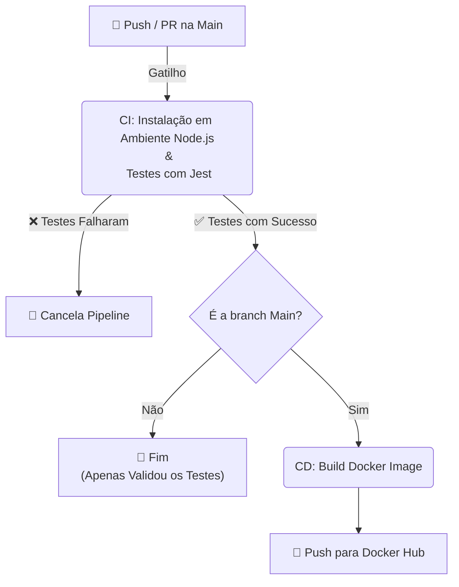

# 📚 Plataforma de Blogging para Educação Pública


Este projeto propõe o desenvolvimento de uma plataforma de blogging voltada à educação pública, com o objetivo de centralizar a criação e o compartilhamento de conteúdos educacionais por professores da rede pública, facilitando o acesso dos alunos a materiais de estudo.

---

## 📌 Visão Geral

A primeira versão da solução foi desenvolvida utilizando **OutSystems**, com boa aceitação em nível comunitário.  
Nesta nova etapa, o projeto evolui para um cenário de maior escala, exigindo:

- Reescrita do back-end em **Node.js**
- Persistência de dados em banco **SQL ou NoSQL**
- Arquitetura preparada para crescimento e manutenção

---

## 🎯 Objetivo do Projeto

Disponibilizar uma solução **moderna, escalável e de fácil uso**, permitindo:

- Criação e gerenciamento de conteúdos educacionais por professores
- Acesso simplificado dos alunos às postagens
- Centralização do conhecimento educacional

---

## ⚙️ Funcionalidades

### API – Endpoints

- `GET /posts` – Lista de postagens disponíveis para leitura  
- `GET /posts/:id` – Retorna o conteúdo completo de uma postagem  
- `POST /posts` – Criação de uma nova postagem  
- `PUT /posts/:id` – Atualização de uma postagem  
- `DELETE /posts/:id` – Remoção de uma postagem  
- `GET /posts/search` – Busca por palavras-chave  

---

## 🛠️ Requisitos Técnicos

- **Back-end:** Node.js com Express  
- **Banco de Dados:** PostgreSQL ou MongoDB  
- **Containerização:** Docker  
- **CI/CD:** GitHub Actions  
- **Testes:** Cobertura mínima de 20%  
- **Documentação:** Setup, arquitetura e uso da API  

---

## 🏗️ Arquitetura

O projeto segue uma arquitetura em camadas, visando desacoplamento, testabilidade e facilidade de manutenção. Cada camada tem uma responsabilidade bem definida:

```
src
│   app.ts              # Configuração do App (Express)
│   server.ts           # Inicialização do servidor
└───api
    └───controllers     # Camada de controle (Interface HTTP)
    └───services        # Regras de negócio e validações
    └───repositories    # Abstração da persistência de dados
    └───models          # Definição dos modelos de dados
└───routes              # Definição das rotas da API
└───utils               # Utilitários (classes de erro, etc.)
└───config              # Configurações de ambiente
```

- **Routes:** Mapeia os endpoints da API para os controllers.
- **Controllers:** Recebem as requisições HTTP. Sua responsabilidade é extrair dados do request, chamar a camada de serviço e retornar a resposta. Não devem conter regras de negócio. Ex: PostController.
- **Servicess:** Contêm a lógica de negócio e as validações. Por exemplo, o PostService valida se um post tem título válido antes de criar. É aqui que os erros de negócio (AppError) são lançados.
- **Repositories:** Camada de abstração do acesso a dados. Interage diretamente com a fonte de dados (memória ou banco). Vai facilitar ter essa camada bem separada para plugar o banco. Ex: PostRepository.
- **Models:** Define as estruturas de dados. Ex: a classe Post.
- **Utils:** Ferramentas auxiliares, como a classe AppError para padronização de erros.

---

## 🚀 Instalação e Execução

### Pré-requisitos

- [Node.js](https://nodejs.org/) (versão >= 18.x)
- [Docker](https://www.docker.com/) (Opcional, para execução em container)
- Um banco de dados (PostgreSQL ou MongoDB) instalado e configurado. [TODO - AINDA RODA COM BANCO EM MEMÓRIA]
- (Recomendado) A extensão [REST Client](https://marketplace.visualstudio.com/items?itemName=humao.rest-client) para VS Code, para testar a API.

### Execução Local

1.  **Clone o repositório:**
    ```bash
    git clone https://github.com/FIAPGrupo20/DiarioDeClasse.git
    cd DiarioDeClasse
    ```

2.  **Instale as dependências:**
    ```bash
    npm install
    ```

3.  **Configure as variáveis de ambiente:** [TODO - PULAR POR ENQUANTO - AINDA RODA COM "BANCO EM MEMORIA"]

    Crie um arquivo `.env` na raiz do projeto e adicione as variáveis necessárias para a conexão com o banco de dados.
    ```
    # Exemplo para PostgreSQL
    DB_HOST=localhost
    DB_PORT=5432
    DB_USER=seu_usuario
    DB_PASSWORD=sua_senha
    DB_NAME=diario_de_classe
    ```

4.  **Inicie a aplicação:**
    ```bash
    npm run dev
    ```
    O servidor estará disponível em `http://localhost:3000`. Se você acessar no navegador verá a lista de posts pré configurada em memória.

### Execução com Docker

```bash
# Constrói a imagem Docker
docker build -t diario-de-classe .

# Executa o container na porta 3000
docker run -p 3000:3000 -d --name diario-de-classe-container diario-de-classe

# Lembrando que é possível testar via requests.http mesmo rodando em container
```

---

## 🧪 Testes
O projeto possui duas formas de teste: testes automatizados e testes manuais da API.

### Testes Automatizados:
Para rodar os testes automatizados.
```bash
npm run test
```
### Testes Manuais (com REST Client):
Para facilitar a interação e os testes com os endpoints da API, o projeto inclui o arquivo requests.http. Recomendamos o uso da extensão REST Client para Visual Studio Code.
1. Instale a extensão REST Client no seu VS Code.
2. Com a aplicação em execução (local no npm run dev ou via docker com docker run), abra o arquivo requests.http.
3. Clique no texto Send Request que aparece acima de cada requisição que deseja testar.
4. A resposta da API será exibida em uma nova aba ao lado.

Isso permite testar de forma rápida e visual todos os endpoints, incluindo casos de sucesso e de erro, conforme documentado no arquivo.

### Boas Práticas para Testes

Para manter a qualidade e a consistência dos testes automatizados, siga as seguintes boas práticas ao criar novos testes:

1.  **Estrutura de Diretórios:**
    Mantenha a estrutura de diretórios de `src` espelhada na pasta `tests`. Isso facilita a localização dos testes correspondentes a cada arquivo da aplicação.
    - Exemplo: O teste para `src/api/services/PostService.ts` deve estar em `tests/api/services/PostService.test.ts`.

2.  **Nomenclatura:**
    - **Arquivos:** Nomeie os arquivos de teste com o sufixo `.test.ts` (ex: `NomeDoArquivo.test.ts`).
    - **Descrições:** Escreva descrições claras e objetivas nos blocos `describe` (contexto) e `it` (comportamento esperado). Utilize o padrão "deve [fazer algo] quando [em tal condição]".

3.  **Padrão AAA (Arrange, Act, Assert):**
    Organize seus testes em três partes distintas para maior clareza:
    - **Arrange:** Configure as condições iniciais, como mocks, dados de entrada e instâncias de classes.
    - **Act:** Execute a função ou o método que está sendo testado.
    - **Assert:** Verifique se o resultado obtido é o esperado.

4.  **Independência dos Testes:**
    Cada bloco `it` deve ser independente. A execução de um teste não deve afetar o resultado de outro. Utilize `beforeEach` para resetar o estado entre os testes.

---

## 🔄 CI/CD e DevOps

Este projeto utiliza **GitHub Actions** para automação da esteira de desenvolvimento, garantindo a qualidade do código e a entrega contínua da aplicação.

### Pipeline Automatizado

O fluxo de trabalho (`.github/workflows/main.yml`) é acionado em todo *push* ou *Pull Request* para a branch `main`.
Existe cache de dependências no ambiente do runner, build otimizada com Dockerfile multi-stage e versionamento semântico no push para Docker Hub.



---

## 📦 Entregáveis

- Código-fonte versionado no GitHub
- Dockerfile e CI/CD
- Documentação técnica
- Demonstração da aplicação

---

## 📜 Licença

Este projeto está licenciado sob a **Licença MIT**.
A licença permite o uso, modificação e distribuição do software, desde que os créditos e os termos da licença original sejam preservados.
